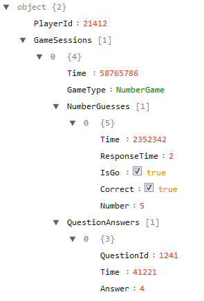

# 2017-Cognitive-Sensors
Team Wan’s aim is to create a cognitive testing game which will use existing testing concepts used by academic researchers. With integrated self-report questionnaires regarding depression symptoms and could therefore be used to provide information about depression symptoms over time in the user. Self-report questionnaires often have problems with bias, but it is hoped that integrating these questionnaires into the cognitive testing could limit this.

Team Wan aims to create an app designed for scientific research on cognitive activity. To do this, the app will contain game(s) that collect data on the user’s tendency to mind-wander. The primary game intended to be used in the app is a game that displays a stream of digits to the user. When a user sees a digit they are supposed to tap unless it is a certain predefined digit, in which case they have to ignore it. This data can hopefully be used to give insight to when people are more active and alert.

## App
The Android application files are located in 2017-Cognitive-Sensors/Wander. The application was developed and can be built using Android Studio.  In order to do this one simply clones the repository to their computer.  Then, checkout the branch that work will be done in.  Open Android Studio (make sure its fully updated or there might be build errors, you will receive a toast notification in the bottom-right corner of your studio when you start the application if it is not up-to-date.  You can follow those links to update.) and navigate to the File - > Open... -> and navigate to the Wander folder (which should have an Android Studio icon indicating that it is openable as a project) and open it.

If you've never used Android Studio before there are a few things to note.  Access files from the project on the far left set of tabs under "Project" and then all the code is available, and the Java code specifically under the package that is NOT labelled (androidTest) or (test).  In order to test code you should configure a virtual phone and run it on there.  You can also put your personal android phone in developer mode and test code on there which is a lot quicker to setup.

[You can find documentation on the emulator here](https://developer.android.com/studio/run/emulator.html)

[You can find documentation on developer mode here](https://www.howtogeek.com/129728/how-to-access-the-developer-options-menu-and-enable-usb-debugging-on-android-4.2/)

Something to note: If you're not completely up to date with your Android Studio, particularly Gradle, your builds might encounter issues.  To avoid this please just update everything before you even clone the repository (if you've just downloaded the software suite you're fine).  Also, you must wait for the Gradle build to finish before you can run the app, this can take a few minutes the first time you open it.

[You can find documentation on updating Android Studio here](https://developer.android.com/studio/intro/update.html)

[You can find documentation on Gradle here](https://developer.android.com/studio/releases/gradle-plugin.html)

## Server
For the server side, a Google Web App is used. This document can be found [here](https://docs.google.com/spreadsheets/d/11B4swCBJJOPQxJuCC7GZ-atJyUtk2wHHVclxLwEtkOI/edit#gid=978512187). The structure follows the ORM design file located in /Server. To send requests and data, [this URL](https://script.google.com/macros/s/AKfycbxvbf-dg4ZYc-vFpCCygBgsPpcHl7G31kMmouhhbA6pO-2luQk/exec) should be put in the string.xml file in the [values folder](Wander/app/src/main/res/values/strings.xml). The following JSON structure is required to upload to the web app: 

## Setup

### Server
To set up the server, first create a new Google Spreadsheet. Add four sheets to the spreadsheet, called *GameSessions*, *NumberGuesses*, *QuestionAnswers* and *Questions*. The data will be stored in these sheets. Now open the scripteditor (*Extra*, *Scripteditor…*). Add the scripts in the folder [Server](Server) to the project. To deploy the app, click *Publish* and then *Implement as web app…*. This will give you a URL you can use for your application.
